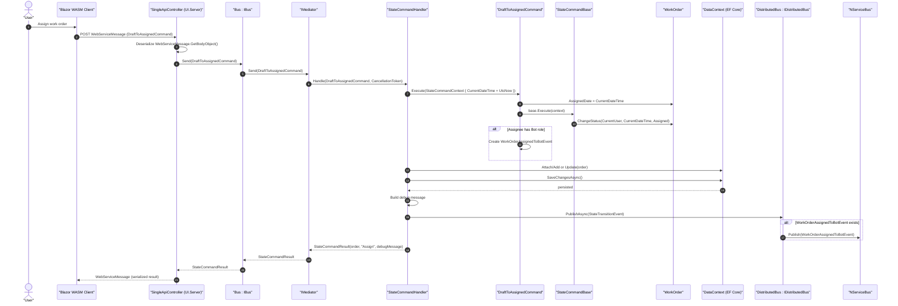

# DraftToAssignedCommand Sequence Diagram

```mermaid
sequenceDiagram
autonumber

actor user as "User"
participant ui as "Blazor WASM Client"
participant api as "SingleApiController (UI.Server)"
participant sBus as "Bus : IBus"
participant mediator as "IMediator"
participant cmdHandler as "StateCommandHandler"
participant cmd as "DraftToAssignedCommand"
participant cmdBase as "StateCommandBase"
participant order as "WorkOrder"
participant db as "DataContext (EF Core)"
participant dBus as "DistributedBus : IDistributedBus"
participant nsb as "NServiceBus"

user->>ui: Assign work order
ui->>api: POST WebServiceMessage (DraftToAssignedCommand)
api->>api: Deserialize WebServiceMessage.GetBodyObject()
api->>sBus: Send(DraftToAssignedCommand)
sBus->>mediator: Send(DraftToAssignedCommand)
mediator->>cmdHandler: Handle(DraftToAssignedCommand, CancellationToken)
cmdHandler->>cmd: Execute(StateCommandContext { CurrentDateTime = UtcNow })
cmd->>order: AssignedDate = CurrentDateTime
cmd->>cmdBase: base.Execute(context)
cmdBase->>order: ChangeStatus(CurrentUser, CurrentDateTime, Assigned)
alt Assignee has Bot role
    cmd->>cmd: Create WorkOrderAssignedToBotEvent
end
cmdHandler->>db: Attach/Add or Update(order)
cmdHandler->>db: SaveChangesAsync()
db-->>cmdHandler: persisted
cmdHandler->>cmdHandler: Build debug message
cmdHandler->>dBus: PublishAsync(StateTransitionEvent)
alt WorkOrderAssignedToBotEvent exists
    dBus->>nsb: Publish(WorkOrderAssignedToBotEvent)
end
cmdHandler-->>mediator: StateCommandResult(order, "Assign", debugMessage)
mediator-->>sBus: StateCommandResult
sBus-->>api: StateCommandResult
api-->>ui: WebServiceMessage (serialized result)
```
