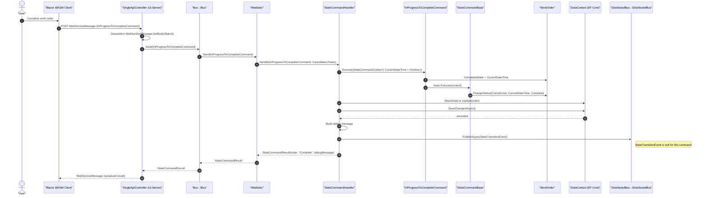

# InProgressToCompleteCommand Sequence Diagram

```mermaid
sequenceDiagram
autonumber

actor user as "User"
participant ui as "Blazor WASM Client"
participant api as "SingleApiController (UI.Server)"
participant sBus as "Bus : IBus"
participant mediator as "IMediator"
participant cmdHandler as "StateCommandHandler"
participant cmd as "InProgressToCompleteCommand"
participant cmdBase as "StateCommandBase"
participant order as "WorkOrder"
participant db as "DataContext (EF Core)"
participant dBus as "DistributedBus : IDistributedBus"

user->>ui: Complete work order
ui->>api: POST WebServiceMessage (InProgressToCompleteCommand)
api->>api: Deserialize WebServiceMessage.GetBodyObject()
api->>sBus: Send(InProgressToCompleteCommand)
sBus->>mediator: Send(InProgressToCompleteCommand)
mediator->>cmdHandler: Handle(InProgressToCompleteCommand, CancellationToken)
cmdHandler->>cmd: Execute(StateCommandContext { CurrentDateTime = UtcNow })
cmd->>order: CompletedDate = CurrentDateTime
cmd->>cmdBase: base.Execute(context)
cmdBase->>order: ChangeStatus(CurrentUser, CurrentDateTime, Complete)
cmdHandler->>db: Attach/Add or Update(order)
cmdHandler->>db: SaveChangesAsync()
db-->>cmdHandler: persisted
cmdHandler->>cmdHandler: Build debug message
cmdHandler->>dBus: PublishAsync(StateTransitionEvent)
Note right of dBus: StateTransitionEvent is null for this command
cmdHandler-->>mediator: StateCommandResult(order, "Complete", debugMessage)
mediator-->>sBus: StateCommandResult
sBus-->>api: StateCommandResult
api-->>ui: WebServiceMessage (serialized result)
```
