# Church Bulletin DevOps Pipeline

This diagram models the end-to-end delivery pipeline from local development through production deployment.

## Source Files

| File | Purpose |
|------|---------|
| `build.ps1` | Build orchestration (Init, Compile, UnitTests, IntegrationTest, Package-Everything) |
| `privatebuild.ps1` | Local quality gate — runs `Build` (compile + unit + integration tests) |
| `acceptancetests.ps1` | Local quality gate — runs `Invoke-AcceptanceTests` (Playwright) |
| `.github/workflows/build.yml` | CI workflow — 8 parallel jobs + 3 publish jobs, triggers on all pushes |
| `.github/workflows/deploy.yml` | CD workflow — TDD → UAT → Prod, triggers on Build completion (master only) |
| `.octopus/deployment_process.ocl` | Octopus steps — .NET 10 check, DB migrations (DbUp), Container App update |
| `.github/copilot-code-review-instructions.md` | Copilot PR review rules |

## Pipeline Diagram

```mermaid
C4Deployment
  title Church Bulletin DevOps Pipeline
  UpdateLayoutConfig($c4ShapeInRow="3", $c4BoundaryInRow="1")

  Deployment_Node(local, "Developer Workstation", "Local machine") {
    Container(privatebuild, "privatebuild.ps1", "PowerShell", "Init, Compile, Unit Tests, DB Setup, Integration Tests")
    Container(accepttests, "acceptancetests.ps1", "PowerShell + Playwright", "Compile, DB Setup, Acceptance Tests")
  }

  Deployment_Node(github, "GitHub", "Source Control + CI/CD") {
    Deployment_Node(feature, "Feature Branch", "git push") {
      Deployment_Node(build_wf, "Build Workflow", "build.yml, on: push, all branches") {
        Container(build_sql, "Integration Build (SQL Container)", "ubuntu-latest", "Init, Compile, UnitTests, DB Setup, IntegrationTest")
        Container(build_sqlite, "Integration Build (SQLite)", "ubuntu-latest", "Build -UseSqlite")
        Container(build_arm, "Integration Build (ARM SQLite)", "ubuntu-24.04-arm", "Build -UseSqlite")
        Container(build_win, "Integration Build (Windows)", "windows-latest", "Build with LocalDB")
        Container(code_analysis, "Code Analysis", "dotnet format", "style, analyzers, EnforceCodeStyleInBuild")
        Container(security_scan, "Security Scan", "Gitleaks + dotnet list", "NuGet vulnerabilities, secrets, credential files")
        Container(at_x86, "Acceptance Tests (x86)", "Playwright + SQLite", "Invoke-AcceptanceTests")
        Container(at_arm, "Acceptance Tests (ARM)", "Playwright + SQLite", "Invoke-AcceptanceTests -UseSqlite")
      }
      Deployment_Node(publish, "Publish", "needs: build-linux") {
        Container(docker_acr, "Docker Build to ACR", "churchbulletingithubacr.azurecr.io", "Build and push container image")
        Container(gh_packages, "GitHub Packages", "nuget.pkg.github.com", "Publish NuGet packages")
        Container(octo_push, "Octopus Feed", "dotnet-octo push", "Publish NuGet packages to Octopus built-in feed")
      }
    }

    Deployment_Node(pr, "Pull Request", "Branch protection") {
      Container(checks, "Branch Protection Checks", "GitHub", "Build status + Deploy to TDD status")
      Container(copilot_review, "Copilot Code Review", "GitHub Copilot", "Architecture, Security, Testing, Naming, Dependencies")
      Container(human_review, "Human Reviewer", "GitHub PR Review", "Manual approval")
    }

    Deployment_Node(master, "master branch", "merge trigger") {
      Container(master_build, "Build Workflow (master)", "GitHub Actions", "Same 8 parallel jobs + packaging + publishing")
    }

    Deployment_Node(deploy_wf, "Deploy Workflow", "deploy.yml, workflow_run trigger") {
      Container(tdd_deploy, "Deploy to TDD", "GitHub Actions + Octopus", "Create release, Deploy, Health check, Acceptance Tests, Report status")
      Container(uat_deploy, "Deploy to UAT", "GitHub Actions + Octopus", "Manual approval required, master/main only")
      Container(prod_deploy, "Deploy to Prod", "GitHub Actions + Octopus", "Manual approval required")
    }
  }

  Deployment_Node(octopus, "Octopus Deploy", "Deployment server, per environment") {
    Container(octo_dotnet, "Ensure .NET 10", "PowerShell", "Check/install .NET 10 runtime on hosted Windows worker")
    Container(octo_db, "Run DB Migrations", "DbUp", "Execute migration scripts from ChurchBulletin.Database package")
    Container(octo_app, "Update Container App", "Azure CLI", "az containerapp update, new image + connection string")
  }

  Deployment_Node(azure, "Azure", "Cloud infrastructure") {
    Container(tdd_env, "TDD Environment", "Azure Container Apps", "Test-driven development environment")
    Container(uat_env, "UAT Environment", "Azure Container Apps", "User acceptance testing environment")
    Container(prod_env, "Prod Environment", "Azure Container Apps", "Production environment")
  }

  Rel(privatebuild, build_sql, "git push", "feature branch")
  Rel(build_sql, docker_acr, "artifacts", "NuGet packages")
  Rel(docker_acr, checks, "status checks", "build results")
  Rel(human_review, master_build, "merge", "approved PR")
  Rel(master_build, tdd_deploy, "workflow_run", "completed + master")
  Rel(tdd_deploy, uat_deploy, "needs", "TDD success + master only")
  Rel(uat_deploy, prod_deploy, "needs", "UAT success")
  Rel(tdd_deploy, octo_dotnet, "triggers", "each environment")
  Rel(octo_dotnet, octo_db, "then")
  Rel(octo_db, octo_app, "then")
  Rel(octo_app, tdd_env, "deploys to", "TDD")
  Rel(octo_app, uat_env, "deploys to", "UAT")
  Rel(octo_app, prod_env, "deploys to", "Prod")
```



## Pipeline Stages

| # | Stage | Trigger | Tool | Key Steps |
|---|-------|---------|------|-----------|
| 1 | **Private Build** | Manual (`privatebuild.ps1`) | PowerShell + .NET CLI | Clean, Compile, Unit Tests, DB Migrate, Integration Tests |
| 2 | **Acceptance Tests** | Manual (`acceptancetests.ps1`) | PowerShell + Playwright | Compile, DB Setup, Playwright browser tests |
| 3 | **Integration Build** | `git push` (all branches) | GitHub Actions | 4 build matrix variants (SQL Container, SQLite, ARM, Windows) |
| 4 | **Code Analysis** | `git push` (all branches) | GitHub Actions | `dotnet format style`, `dotnet format analyzers`, `EnforceCodeStyleInBuild` |
| 5 | **Security Scan** | `git push` (all branches) | GitHub Actions | NuGet vulnerability scan, Gitleaks, credential file scan, code pattern scan |
| 6 | **Acceptance Tests (CI)** | `git push` (all branches) | GitHub Actions | Playwright tests on x86 SQLite and ARM SQLite |
| 7 | **Publish** | After build-linux succeeds | GitHub Actions | Docker → ACR, NuGet → GitHub Packages, NuGet → Octopus |
| 8 | **PR Review** | PR opened | Copilot + Human | Architecture, security, testing standards, dependency review |
| 9 | **Deploy to TDD** | Build completed on `master` | GitHub Actions + Octopus | Create release, deploy, health check, acceptance tests, report status |
| 10 | **Deploy to UAT** | Manual approval gate | GitHub Actions + Octopus | Deploy same Octopus release to UAT environment |
| 11 | **Deploy to Prod** | Manual approval gate | GitHub Actions + Octopus | Deploy same Octopus release to Prod environment |

## Build Function Call Graph

```
privatebuild.ps1 → Build()
                      ├── Init()           — clean, restore
                      ├── Compile()        — dotnet build (warnings-as-errors)
                      ├── UnitTests()      — dotnet test (NUnit + code coverage)
                      ├── Setup-DatabaseForBuild()
                      │     ├── SQL-Container: Docker + migrate
                      │     └── LocalDB: integrated auth + migrate
                      └── IntegrationTest() — dotnet test

acceptancetests.ps1 → Invoke-AcceptanceTests()
                        ├── Init()
                        ├── Compile()
                        ├── Setup-DatabaseForBuild()
                        └── AcceptanceTests() — Playwright

CI Build (build.yml) → Build() + Package-Everything()
                                    ├── PackageUI()              → ChurchBulletin.UI.nupkg
                                    ├── PackageDatabase()        → ChurchBulletin.Database.nupkg
                                    ├── PackageAcceptanceTests() → ChurchBulletin.AcceptanceTests.nupkg
                                    └── PackageScript()          → ChurchBulletin.Script.nupkg
```

## Octopus Deployment Process

Each environment (TDD, UAT, Prod) executes the same deployment process defined in `.octopus/deployment_process.ocl`:

| Step | Name | Description |
|------|------|-------------|
| 1 | Ensure .NET 10 installed | Checks/installs .NET 10 runtime on hosted Windows worker |
| 2 | Run DB migrations | Executes DbUp scripts from `ChurchBulletin.Database` package |
| 3 | Add Revision to Container App | `az containerapp update` with new container image + connection string |

## Key Design Principles

- **Immutable Artifacts** — Same NuGet packages flow unchanged through TDD → UAT → Prod
- **Approval Gates** — UAT and Prod require manual reviewer approval via GitHub environment protection rules
- **Branch Protection** — PRs require passing Build checks and Deploy to TDD status
- **Copilot Code Review** — Automated architectural and standards enforcement on every PR
- **TDD Status Reporting** — Uses GitHub Statuses API to report deployment results back to PR commit SHA
- **Concurrency Control** — Build jobs are cancelled on new commits; master deploys queue instead of cancel
